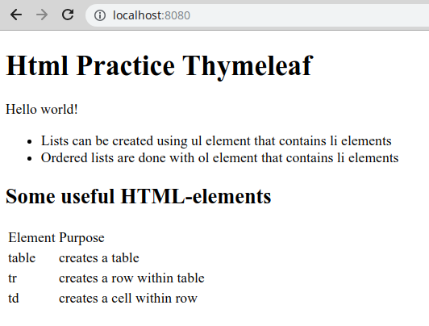

<text-box variant='learningObjectives' name='Oppimistavoitteet'>

- Harjoittelet HTML-kielen käyttöä ja tunnet HTML-kielen peruskomennot.
- Tunnet käsitteen näkymä-template.
- Tiedät Thymeleaf-kirjaston ja osaat muodostaa Thymeleafia käyttäviä HTML-muotoisia näkymä-templateja.
- Osaat näyttää palvelimelta palautettua tietoa (muuttujat, listat, oliot) HTML-sivulla.
- Tiedät mitä `@ResponseBody`-annotaatio tekee ja tiedät mitä tapahtuu jos sitä ei ole asetettu pyyntöä käsittelevään metodiin.

</text-box>

<quiz id="b3342ee5-23e7-5796-bf93-8487b1ee7c0a"></quiz>


Sovelluksemme ovat vastaanottaneet tiettyyn polkuun tulevan pyynnön ja palauttaneet käyttäjälle merkkijonomuodossa olevaa tietoa. Palvelin voi myös luoda käyttäjälle näkymän, jonka selain lopulta näyttää käyttäjälle.

Näkymät luodaan tyypillisesti apukirjastojen avulla siten, että ohjelmoija luo HTML-näkymät ja upottaa HTML-koodiin kirjastospesifejä komentoja. Nämä komennot mahdollistavat mm. tiedon lisäämisen sivuille. Tällaisia HTML-sivuja, joihin on upotettu kirjastokohtaisia tiedon lisäämiseen tarkoitettuja komentoja kutsutaan näkymä-templateiksi (jatkossa template).

Tällä kurssilla käyttämämme apuväline näkymän luomiseen on <a href="http://www.thymeleaf.org/" target="_blank">Thymeleaf</a>, joka tarjoaa välineitä datan lisäämiseen HTML-sivuille. Käytännössä näkymiä luodessa luodaan ensin HTML-sivu, jonka jälkeen sivulle lisätään komentoja Thymeleafin käsiteltäväksi.

<br/>

Thymeleaf-sivut ("templatet") sijaitsevat projektin kansiossa `src/main/resources/templates` tai sen alla olevissa kansioissa. NetBeansissa kansio löytyy kun klikataan "Other Sources"-kansiota.


<text-box variant='hint' name='Thymeleafin käyttöönotto'>

Thymeleafin käyttöönotto vaatii uuden riippuvuuden (eli kirjaston tai kirjastojen) lisäämistä `pom.xml`-tiedoston `dependencies`-osioon. Kun lisäämme `dependencies`-osioon riippuvuuden `spring-boot-starter-thymeleaf`, pääsemme käyttämään Thymeleafia.


```xml
<dependency>
    <groupId>org.springframework.boot</groupId>
    <artifactId>spring-boot-starter-thymeleaf</artifactId>
</dependency>
```

Tehtäväpohjissa määrittely on tehty valmiiksi.

</text-box>


Alla olevassa esimerkissä luodaan juuripolkua `/` kuunteleva sovellus. Kun sovellukseen tehdään pyyntö, palautetaan HTML-sivu, jonka Thymeleaf käsittelee. Spring päättelee käsiteltävän ja palautettavan sivun merkkijonon perusteella. Alla metodi palauttaa merkkijonon `"index"`, jolloin Spring etsii kansiosta `src/main/resources/templates/` sivua `index.html`. Kun sivu löytyy, se annetaan Thymeleafin käsiteltäväksi, jonka jälkeen sivu palautetaan käyttäjälle.

```java
package thymeleaf;

import org.springframework.stereotype.Controller;
import org.springframework.web.bind.annotation.GetMapping;

@Controller
public class ThymeleafController {

    @GetMapping("/")
    public String home() {
        return "index";
    }
}
```

Toisin kuin aiemmin, pyyntöjä käsittelevällä metodilla ei ole annotaatiota `@ResponseBody`. Mikäli metodilla olisi annotaatio `@ResponseBody`, palautettaisiin käyttäjälle merkkijono "index".

Kun annotaatiota `@ResponseBody` ei ole määritelty metodille, Spring tietää, että palautettu merkkijono liittyy käyttäjälle näytettävään näkymään. Projektin `pom.xml`-tiedostossa olevan `spring-boot-starter-thymeleaf` riippuvuuden takia Spring tietää tarkemmin, että kyse on Thymeleaf-kirjastolle käsiteltäväksi annettavasta näkymästä -- se siis etsii "index"-merkkijonoon liittyvän tiedoston ja antaa sen Thymeleafin käsiteltäväksi. Lopullinen tulos ohjataan sitten käyttäjälle.


<programming-exercise name='Hello Thymeleaf' tmcname='osa02-Osa02_01.HelloThymeleaf'>

Toteuta tässä tehtävässä pakkauksessa `hellothymeleaf` sijaitsevaan `HelloThymeleafController`-luokkaan seuraava toiminnallisuus:

- Pyyntö juuripolkuun `/` palauttaa käyttäjälle Thymeleafin avulla kansiossa `src/main/resources/templates/` olevan `index.html`-tiedoston.
- Pyyntö polkuun `/video` palauttaa käyttäjälle Thymeleafin avulla kansiossa `src/main/resources/templates/` olevan `video.html`-tiedoston.

Alla on esimerkki ohjelman toiminnasta, kun selaimella on tehty pyyntö sovelluksen juuripolkuun.


</programming-exercise>


<text-box variant='hint' name='HTML'>

Jos mietit mistä ihmeestä tuossa HTML-lyhenteessä on kyse tai haluat verestää HTML-osaamistasi, nyt on hyvä hetki käydä lukemassa osoitteessa <a href="http://www.w3schools.com/html/default.asp" target="_blank">http://www.w3schools.com/html/default.asp</a> oleva HTML-opas.

</text-box>


<programming-exercise name='Html Practice' tmcname='osa02-Osa02_02.HtmlPractice'>

Toteuta tehtäväpohjan kansiossa `src/main/resources/templates/` olevaan tiedostoon `index.html` sivu, joka käyttää `h1`, `h2`, `ul`, `li`, `p`, `table`, `tr`, ja `td` elementtejä järkevällä tavalla.

Eräs mahdollinen lopputulos näyttää seuraavalta.



Tehtävässä ei ole testejä. Palauta tehtävä TMC:lle kun olet toteuttanut tehtävänannossa toivotun toiminnallisuuden.

</programming-exercise>

## Tiedon lisääminen näkymään Model-luokan avulla

Palvelinohjelmistossa luodun tai haetun datan lisääminen näkymään tapahtuu <a href="http://docs.spring.io/spring/docs/current/javadoc-api/org/springframework/ui/Model.html" target="_blank">Model</a>-olion avulla.

<br/>

Kun lisäämme Model-olion pyyntöjä käsittelevän metodin parametriksi, lisää Spring-sovelluskehys sen automaattisesti käyttöömme.


```java
package thymeleafdata;

import org.springframework.stereotype.Controller;
import org.springframework.ui.Model;
import org.springframework.web.bind.annotation.GetMapping;

public class ThymeleafJaDataController {

    @GetMapping("/")
    public String home(Model model) {
        return "index";
    }
}
```

Model on Spring-sovelluskehyksen käyttämä hajautustaulun toimintaa jäljittelevä olio. Alla olevassa esimerkissä määrittelemme pyyntöjä käsittelevälle metodille Model-olion, jonka jälkeen lisäämme lokeroon nimeltä `teksti` arvon `"Hei mualima!"`. Tämän jälkeen palautetaan merkkijono "index", jonka perusteella Spring päättelee että pyyntö ohjataan Thymeleafille.


```java
package thymeleafdata;

import org.springframework.stereotype.Controller;
import org.springframework.ui.Model;
import org.springframework.web.bind.annotation.GetMapping;

@Controller
public class ThymeleafJaDataController {

    @GetMapping("/")
    public String home(Model model) {
        model.addAttribute("teksti", "Hei mualima!");
        return "index";
    }
}
```

Kun käyttäjä tekee pyynnön, joka ohjautuu yllä olevaan metodiin, ohjautuu pyyntö `return`-komennon jälkeen Thymeleafille, joka saa käyttöönsä Model-olion ja siihen lisätyt arvot sekä tiedon näytettävästä sivusta.

Oletetaan, että käytössämme olevan `index.html`-sivun lähdekoodi on seuraavanlainen:

```xml
<!DOCTYPE html>
<html xmlns="http://www.w3.org/1999/xhtml" xmlns:th="http://www.thymeleaf.org">
    <head>
        <title>Otsikko</title>
    </head>

    <body>
        <h1>Hei maailma!</h1>

        <h2 th:text="${teksti}">testi</h2>
    </body>
</html>
```

Kun Thymeleaf käsittelee HTML-sivun, se etsii sieltä elementtejä, joilla on `th:`-alkuisia attribuutteja. Yllä olevasta sivusta Thymeleaf löytää `h2`-elementin, jolla on attribuutti `th:text` -- `<h2 th:text="${teksti}">testi</h2>`. Attribuutti `th:text` kertoo Thymeleafille, että elementin tekstiarvo (tässä "testi") tulee korvata attribuutin arvon ilmaisemalla muuttujalla. Attribuutin `th:text` arvona on `${teksti}`, jolloin Thymeleaf etsii `model`-oliosta arvoa avaimella `"teksti"`.

Käytännössä Thymeleaf etsii -- koska sivulla olevasta elementistä löytyy attribuutti `th:text="${teksti}"` -- Model-oliosta lokeron nimeltä `teksti` ja asettaa siinä olevan arvon elementin tekstiarvoksi. Tässä tapauksessa teksti `testi` korvataan Model-olion lokerosta teksti löytyvällä arvolla, eli aiemman esimerkkimme tekstillä `Hei mualima!`.

Annotaatiolla `@Controller` merkityssä luokassa oleville metodeille voi määritellä parametrit hyvin vapaasti. Esimerkiksi `Model`-olio ja pyynnön mukana tulevat parametrit käsitellään määrittelemällä metodi, jolla on parametrina sekä `Model`-olio, että parametrit.


<programming-exercise name='Hello Model' tmcname='osa02-Osa02_03.HelloModel'>

Tehtäväpohjan mukana tulevaan HTML-tiedostoon on toteutettu tarina, joka tarvitsee otsikon ja päähenkilön. Toteuta pakkauksessa `hellomodel` sijaitsevaan `HelloModelController`-luokkaan toiminnallisuus, joka käsittelee juuripolkuun tulevia pyyntöjä ja käyttää pyynnössä tulevia parametreja `index.html`-tiedostossa olevan tarinan täydentämiseen.

Pyynnön mukana tulevat parametrit ovat nimeltään `title` ja `person`. Molemmat ovat merkkijonomuotoisia.

Lisää pyynnön mukana tulevien parametrien arvot Thymeleafille annettavaan Model-olioon. Otsikon avaimen tulee olla `"title"` ja henkilön avaimen tulee olla `"person"`. Palautettava sivu on kansiossa `src/main/resources/templates/` oleva `index.html`.

Alla on esimerkki ohjelman toiminnasta, kun juuripolkuun tehdyssä pyynnössä on annettuna otsikoksi `Mökkielämää` ja henkilöksi `Leena`.


Palauta tehtävä TMC:lle kun olet valmis.

</programming-exercise>

<quiz id="f36b3950-9e4f-54af-a55f-59ecf3fad17f"></quiz>


## Kokoelmien näyttäminen Thymeleaf-sivulla

Model-oliolle voi asettaa myös arvokokoelmia. Alla luomme "pääohjelmassa" listan, joka asetetaan Thymeleafin käsiteltäväksi menevään Model-olioon jokaisen juuripolkuun tehtävän pyynnön yhteydessä.


```java
package thymeleafdata;

import java.util.List;
import java.util.ArrayList;
import org.springframework.stereotype.Controller;
import org.springframework.ui.Model;
import org.springframework.web.bind.annotation.GetMapping;
import org.springframework.web.bind.annotation.RequestParam;

@Controller
public class ListaController {
    private List<String> lista;

    public ListaController() {
        this.lista = new ArrayList<>();
        this.lista.add("Hello world!");
        this.lista.add("+[-[<<[+[--->]-[<<<]]]>>>-]>-.---.>..>.<<<<-.<+.>>>>>.>.<<.<-.");
    }

    @GetMapping(value = "/")
    public String home(Model model) {
        model.addAttribute("list", lista);
        return "index";
    }
}
```

Listan läpikäynti Thymeleafissa tapahtuu attribuutin `th:each` avulla. Sen määrittely saa muuttujan nimen, johon kokoelmasta otettava alkio kullakin iteraatiolla tallennetaan, sekä läpikäytävän kokoelman. Perussyntaksiltaan `th:each` on seuraavanlainen.


```xml
<p th:each="alkio : ${lista}">
    <span th:text="${alkio}">hello world!</span>
</p>
```

Yllä käytämme attribuuttia nimeltä `lista` ja luomme jokaiselle sen sisältämälle alkiolle p-elementin, jonka sisällä on span-elementti, jonka tekstinä on alkion arvo. Attribuutin `th:each` voi asettaa käytännössä mille tahansa toistettavalle elementille. Esimerkiksi HTML-listan voisi tehdä seuraavalla tavalla.


```xml
<ul>
    <li th:each="alkio : ${lista}">
        <span th:text="${alkio}">hello world!</span>
    </li>
</ul>
```

Lisää kokoelmien läpikäynnistä löytyy Thymeleafin dokumentaatiosta, kts. <a href="https://www.thymeleaf.org/doc/tutorials/3.0/usingthymeleaf.html#iteration" target="_blank">https://www.thymeleaf.org/doc/tutorials/3.0/usingthymeleaf.html#iteration</a>.

<br/>

Klassisin virhe `th:each`ia käytettäessä on iteroitavan joukon määrittely merkkijonona `th:each="alkio : lista"`. Tämä ei luonnollisesti toimi.


<text-box variant='hint' name='Konstruktorit ja annotoidut luokat'>

Spring luo automaattisesti esimerkiksi `@Controller`-määreellä annotoidusta luokasta olion, joka sitten injektoidaan sovelluksen käyttöön. Jotta tämä luokkien automaattinen luominen toimii, tulee luokalla olla parametriton konstruktori (tai ei lainkaan konstruktoreja). Mikäli luot luokalle parametrillisen konstruktorin, luo myös parametriton konstruktori. Näin varmistat, että sovelluskehys pystyy käyttämään luokkiasi osana toimintaansa.

</text-box>


<programming-exercise name='Hello List' tmcname='osa02-Osa02_04.HelloList'>

Tehtäväpohjassa on lähtökohta sovellukseen, johon voi lisätä dataa ja joka voi listata dataa.

Lisää (1) juuripolkuun tulevan GET-tyyppisen käsittelevään metodiin toiminnallisuus, jonka avulla kontrollerissa oleva listamuuttuja on Thymeleafin käytettävissä. Tämän jälkeen, lisää (2) sovellukseen liittyvälle HTML-sivulle listalla olevien arvojen tulostaminen `th:each`-komennon avulla.

Tehtäväpohjassa näkyy myös toiminnallisuus tiedon lähettämiseen palvelimelle. Syvennymme tähän tarkemmin seuraavassa aliluvussa.

</programming-exercise>

## Lombok-projekti ja boilerplaten vähentäminen

Tutustumme kohta olioiden näyttämiseen sivuilla. Tarkastellaan ennen sitä kuitenkin erästä varsin näppärää kirjastoa.

Javan tietokohteita kuvaavat luokat tarvitsevat oletuksena konstruktoreita sekä gettereitä ja settereitä. Esimerkiksi Thymeleaf hyödyntää luokan get-metodeja HTML-sivuja täydentäessä.

Hyvin yksinkertainenkin luokka -- kuten alla oleva tapahtumaa kuvaava `Event` -- sisältää paljon ohjelmakoodia.


```java
public class Event {

    private String name;

    public Event() {
    }

    public Event(String name) {
        this.name = name;
    }

    public String getName() {
        return this.name;
    }

    public void setName(String name) {
        this.name = name;
    }
}
```

Suurin osa ohjelmakoodista on oleellista vallitsevien käytänteiden takia -- esimerkiksi Thymeleaf tarvitsee getterit -- mutta samalla epäoleellista. Edellä kuvattujen luokkien sekä niiden attribuuttien määrän lisääntyessä projekteissa tulee olemaan lopulta satoja ellei tuhansia rivejä "turhahkoa" lähdekoodia. Tällaista usein toistuvaa, samankaltaista koodia kutsutaan termillä boilerplate.

<a href="https://projectlombok.org/" target="_blank" norel>Lombok</a> on kirjasto, joka on suunniteltu vähentämään projekteissa esiintyvien toisteisten konstruktorien, getterien ja setterien määrää. Lombokin saa projektin käyttöön lisäämällä projektin `pom.xml`-tiedostoon lombok-riippuvuuden.


```xml
<dependency>
    <groupId>org.projectlombok</groupId>
    <artifactId>lombok</artifactId>
    <scope>provided</scope>
</dependency>
```

Projekti tarjoaa mahdollisuuden gettereiden ja settereiden automaattiseen luomiseen siten, että ohjelmoijan ei tarvitse määritellä niitä itse. Ohjelmoijan näkökulmasta edellä kuvattu luokka `Event` toimii täysin samalla tavalla, jos konstruktorit ja metodit poistetaan ja luokkaan lisätään muutama annotaatio.


```java
import lombok.AllArgsConstructor;
import lombok.Data;
import lombok.NoArgsConstructor;

@NoArgsConstructor
@AllArgsConstructor
@Data
public class Event {
    private String name;
}
```

Edellä käytetyt annotaatiot toimivat seuraavasti: Annotaatio `@NoArgsConstructor` luo luokalle parametrittoman konstruktorin, annotaatio `@AllArgsConstructor` luo luokalle kaikki attribuutit sisältävän konstruktorin, ja annotaatio `@Data` luo attribuuteille getterit, setterit, `equals`-metodin, `hashcode`-metodin, ja `toString`-metodin.


<text-box variant='hint' name='IntelliJ Idea'>

Jos käytössäsi on NetBeansin sijaan IntelliJ Idea ohjelmointiympäristö joudut edellisen lisäksi asentamaan 'Lombok Plugin' liitännäisen. Ohjeet tähän löydät <a href="https://projectlombok.org/setup/intellij" target="_blank" norel>täältä</a>. Liitännäisen asentamisen jälkeen voit asetuksista (Build, Execute, Deployment > Compiler > Annotation Processors) laittaa rastin kohtaan "Enable Annotation processing" jonka jälkeen Lombok annotaatioiden pitäisi toimia.

</text-box>


## Olioiden käsittely

Modeliin voi lisätä kokoelmien lisäksi myös muunlaisia olioita. Oletetaan, että käytössämme on henkilöä kuvaava luokka.


```java
// importit

@NoArgsConstructor
@AllArgsConstructor
@Data
public class Henkilo {
    private String nimi;
}
```

Henkilo-olion lisääminen on suoraviivaista:


```java
@GetMapping("/")
public String home(Model model) {
    model.addAttribute("henkilo", new Henkilo("Le Pigeon"));
    return "index";
}
```

Kun sivua luodaan, henkilöön päästään käsiksi modeliin asetetun avaimen perusteella. Edellä luotu "Le Pigeon"-henkilö on tallessa avaimella "henkilo". Kuten aiemminkin, avaimella pääsee olioon käsiksi.

```xml
<h2 th:text="${henkilo}">Henkilön nimi</h2>
```

Ylläolevaa henkilön tulostusta kokeillessamme saamme näkyville olion `toString`-metodin palauttaman arvon.

Pääsemme oliomuuttujiin käsiksi `get*Muuttuja*`-metodien kautta. Jos haluamme tulostaa Henkilo-olioon liittyvän `nimi`-muuttujan, kutsumme metodia `getNimi`, jonka Lombok-projekti generoi käyttöömme automaattisesti mikäli luokalle on määritelty `@Data`-annotaatio. Thymeleafin käyttämässä notaatiossa kutsu muuntuu muotoon `henkilo.nimi`. Saamme siis halutun tulostuksen seuraavalla tavalla:


```xml
<h2 th:text="${henkilo.nimi}">Henkilön nimi</h2>
```


## Olioita listalla

Perussyntaksiltaan `th:each` on tuli jo hetki sitten tutuksi: listan läpikäynti Thymeleafissa tapahtuu attribuutin `th:each` avulla. Sen määrittely saa muuttujan nimen, johon kokoelmasta otettava alkio kullakin iteraatiolla tallennetaan, sekä läpikäytävän kokoelman.

```xml
<p th:each="alkio : ${lista}">
    <span th:text="${alkio}">hello world!</span>
</p>
```

Iteroitavan joukon alkioiden ominaisuuksiin pääsee käsiksi aivan samalla tavalla kuin muiden olioiden ominaisuuksiin. Tutkitaan seuraavaa esimerkkiä, jossa listaan lisätään kaksi henkilöä, lista lisätään pyyntöön ja lopulta luodaan näkymä Thymeleafin avulla.


```java
package henkilot;

import java.util.List;
import java.util.ArrayList;
import org.springframework.stereotype.Controller;
import org.springframework.ui.Model;
import org.springframework.web.bind.annotation.GetMapping;

@Controller
public class HenkiloController {
    private List<Henkilo> henkilot;

    public HenkiloController() {
        this.henkilot = new ArrayList<>();
        this.henkilot.add(new Henkilo("James Gosling"));
        this.henkilot.add(new Henkilo("Martin Odersky"));
    }

    @GetMapping("/")
    public String home(Model model) {
        model.addAttribute("list", henkilot);
        return "index";
    }
}
```

```xml
<p>Ja huomenna puheet pitävät:</p>
<ol>
    <li th:each="henkilo : ${list}">
        <span th:text="${henkilo.nimi}">Esimerkkihenkilö</span>
    </li>
</ol>
```

Käyttäjälle lähetettävä sivu näyttää palvelimella tapahtuneen prosessoinnin jälkeen seuraavalta.

```xml
<p>Ja huomenna puheet pitävät:</p>
<ol>
    <li><span>James Gosling</span></li>
    <li><span>Martin Odersky</span></li>
</ol>
```

<programming-exercise name='Hello Objects' tmcname='osa02-Osa02_05.HelloObjects'>

Tehtäväpohjassa on sovellus, jossa käsitellään `Item`-tyyppisiä olioita. Tehtävänäsi on lisätä sovellukseen seuraava lisätoiminnallisuus:

- Kun käyttäjä avaa selaimella sovelluksen juuripolun (eli tekee sovelluksen juuripolkuun GET-tyyppisen pyynnön), tulee hänen olemassaolevan lomakkeen lisäksi nähdä lista esineistä. Jokaisesta esineestä tulee tulla ilmi sen nimi (name) ja tyyppi (type).

Alla olevassa esimerkissä sovellukseen on lisätty olemassaolevan taikurin hatun lisäksi <a href="https://en.wikipedia.org/wiki/Party_hat" target="_blank">Party hat</a>, eli bilehattu.

<br/>


</programming-exercise>
