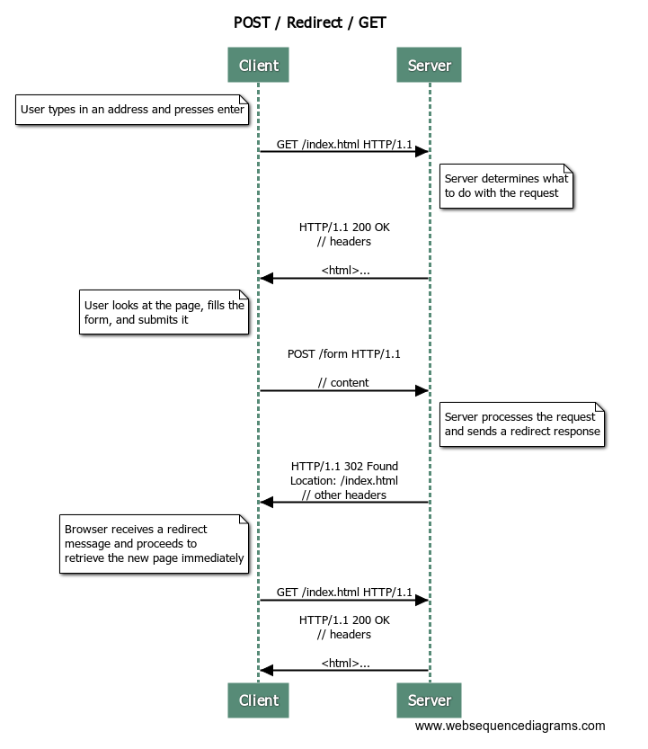

<text-box variant='learningObjectives' name='Oppimistavoitteet'>

- Osaat luoda HTML-muotoisen lomakkeen ja tiedät mitä lomakkeen attribuutit `action` ja `method` tekevät.
- Ymmärrät minkälaisessa muodossa lomakkeen tieto lähetetään palvelimelle.
- Osaat kirjoittaa palvelinohjelmistoon metodin, joka käsittelee lomakkeella lähetetyn tiedon.
- Tiedät mitä POST/Redirect/GET -suunnittelumalli tarkoittaa ja tiedät miksi sitä käytetään.
- Osaat kirjoittaa POST/Redirect/GET -suunnittelumallia noudattavia ohjelmia.

</text-box>


HTML-sivuille voi määritellä lomakkeita (<a href="http://www.w3schools.com/html/html_forms.asp" target="_blank">form</a>), joiden avulla käyttäjä voi lähettää tietoa palvelimelle. Lomakkeen määrittely tapahtuu `form`-elementin avulla, jolle annetaan attribuutteina polku, mihin lomake lähetetään (action), sekä pyynnön tyyppi (method). Pidämme pyynnön tyypin toistaiseksi POST-tyyppisenä.

Lomakkeeseen voidaan määritellä mm. tekstikenttiä (`<input type="text"...`) sekä painike, jolla lomake lähetetään (`<input type="submit"...`). Alla tekstikentän `name`-attribuutin arvoksi on asetettu `nimi`. Tämä tarkoittaa sitä, että kun lomakkeen tiedot lähetetään palvelimelle, tulee pyynnössä `nimi`-niminen parametri, jonka arvona on tekstikenttään kirjoitettu teksti.

```xml
<form action="/" method="POST">
    <input type="text" name="nimi"/>
    <input type="submit"/>
</form>
```

Kun käyttäjälle näytetään yllä oleva lomake selaimessa, käyttäjä näkee tekstikentän sekä napin. Kun käyttäjä painaa nappia, lomakkeen tiedot lähetetään POST-tyyppisenä pyyntönä palvelimelle palvelimen juuriosoitteeseen (action="/"). Mikäli osoitetta, mihin lomakkeen tiedot lähetetään, halutaan muuttaa, tulee attribuutin `action` arvoa muokata sopivasti.

Web-sovellukset eivät kaikki sijaitse palvelimen juuressa. Palvelimella voi olla useampia sovelluksia -- esimerkiksi `https://palvelin.net/sovellus1/` ja `https://palvelin.net/sovellus2/` voivat osoittaa eri sovelluksiin. Jos osoitteessa `https://palvelin.net/sovellus2/` olevassa lomakkeessa on määritelty lomakkeen lähetysosoitteeksi "/", lähetetään lomake osoitteeseen `https://palvelin.net/`. Tämä ei ole toivottua, sillä lomakkeen sovellus sijaitsee polussa `https://palvelin.net/sovellus2/`.

Thymeleafin ja Springin avulla lomakkeista voi tehdä sovelluksen juuripolusta riippumattomat. Tämä tapahtuu määrittelemällä lomakkeen `action`-attribuutti Thymeleafin avulla muodossa `th:action="@{/}"`. Tällöin lomaketta luodessa lomakkeen polku määritellään sovelluksen sijainnin perusteella, riippumatta sovelluksen sijainnista.

```xml
<form th:action="@{/}" method="POST">
    <input type="text" name="nimi"/>
    <input type="submit"/>
</form>
```

Nyt, mikäli sovellus sijaitsee polussa `https://palvelin.net/sovellus2/`, käyttäjälle näkyvään lomakkeeseen vaihdetaan Thymeleafin toimesta `action`-attribuutin arvoksi "/sovellus2/". Vastaavasti, mikäli sovellus sijaitsee palvelimella polussa `https://palvelin.net/sovellus1/`, yllä oleva määrittely muokkaa lomakkeen `action`-attribuutin arvoksi polun "/sovellus1/".

Lomakkeen avulla lähetetty tieto -- jos lähetysmetodiksi on asetettu "POST" -- vastaanotetaan annotaation `@PostMapping` avulla. Annotaatio on kuin `@GetMapping`, mutta annotaatiolla merkitään, että polkuun liitetty metodi kuuntelee POST-tyyppisiä pyyntöjä.

Esimerkiksi yllä olevan lomakkeen tiedot, eli lomakkeen lähettämä parametri `nimi`, voidaan käsitellä seuraavanlaisella metodilla.

```java
@PostMapping("/")
public String post(@RequestParam String nimi) {
    System.out.println(nimi);
    return "index";
}
```

Yllä oleva metodi kuuntelee POST-tyyppisiä pyyntöjä sovelluksen juuripolkuun. Se saa merkkijonotyyppisen `nimi`-nimisen parametrin pyynnön mukana. Metodi tulostaa parametrin arvon `System.out.println`-kutsun avulla ja pyytää Thymeleafia näyttämään kansiosta `src/main/resources/templates/` tiedoston `index.html`.


<programming-exercise name='Hello Form' tmcname='osa02-Osa02_06.HelloForm'>

Tehtäväpohjassa on toiminnallisuus, jonka avulla sivulla voi näyttää tietoa, ja jonka avulla sivulta lähetetty tieto voidaan myös käsitellä. Tiedon lähettämiseen tarvitaan sivulle kuitenkin lomake.

Toteuta tehtäväpohjan kansiossa `src/main/resources/templates` olevaan `index.html`-tiedostoon lomake. Lomakkeessa tulee olla tekstikenttä, jonka nimen tulee olla `content`. Tämän lisäksi, lomakkeessa tulee olla myös nappi, jolla lomakkeen voi lähettää. Lomakkeen tiedot tulee lähettää juuriosoitteeseen POST-tyyppisellä pyynnöllä.

Kun sovellus toimii oikein, voit vaihtaa sivulla näkyvää otsikkoa lomakkeen avulla.

</programming-exercise>


## Post/Redirect/Get -suunnittelumalli

Kun palvelimelle lähetetään tietoa `POST`-tyyppisessä pyynnössä, pyynnön parametrit kulkevat pyynnön rungossa. Mikäli yllä olevan tehtävän lomakkeella lähetetään tietoa palvelimelle, vaikkapa merkkijono "Hei maailma!", on pyyntö HTTP-muodossa seuraavanlainen.

<pre>
POST / HTTP/1.1
Host: localhost:8080
// muita otsakkeita

content=Hei maailma!

</pre>


Edellisessä tehtävässä POST-pyyntöä käsittelevä metodi palautti merkkijonon "redirect:/". Mistä tässä oikein oli kyse?

Oikeastaan kaikki pyynnöt, joissa lähetetään tietoa palvelimelle, ovat ongelmallisia jos pyynnön vastauksena palautetaan näytettävä sivu. Tällöin käyttäjä voi sivun uudelleenlatauksen (esim. painamalla F5) yhteydessä lähettää aiemmin lähettämänsä datan vahingossa uudelleen.

Palvelimen toiminnallisuus, joka vastaanottaa dataa, tulee toteuttaa siten, että lähetetyn tiedon käsittelyn jälkeen käyttäjälle palautetaan vastauksena uudelleenohjauspyyntö. Tämän jälkeen käyttäjän selain tekee uuden pyynnön uudelleenohjauspyynnön mukana annettuun polkuun. Tätä toteutustapaa kutsutaan <a href="http://en.wikipedia.org/wiki/Post/Redirect/Get" target="_blank">Post/Redirect/Get</a>-suunnittelumalliksi ja sillä mm. estetään lomakkeiden uudelleenlähetys, jonka lisäksi vähennetään toiminnallisuuden toisteisuutta.

<br/>

Alla on toteutettu POST-tyyppistä pyyntöä kuunteleva polku sekä siihen liittyvä toiminnallisuus. POST-tyyppinen pyyntö määritellään annotaation `@PostMapping` avulla. Palauttamalla pyyntöä käsittelevästä metodista merkkijono `redirect:/` kerrotaan, että pyynnölle tulee lähettää vastauksena uudelleenohjauspyyntö polkuun `"/"`. Kun selain vastaanottaa uudelleenohjauspyynnön, tekee se GET-tyyppisen pyynnön uudelleenohjauspyynnössä annettuun osoitteeseen.


```java
package uudelleenohjaus;

import java.util.List;
import java.util.ArrayList;
import org.springframework.stereotype.Controller;
import org.springframework.ui.Model;
import org.springframework.web.bind.annotation.GetMapping;
import org.springframework.web.bind.annotation.PostMapping;
import org.springframework.web.bind.annotation.RequestParam;

@Controller
public class RedirectOnPostController {

    private String message;

    @GetMapping("/")
    public String home(Model model) {
        model.addAttribute("message", message);
        return "index";
    }

    @PostMapping("/")
    public String post(@RequestParam String content) {
        this.message = content;
        return "redirect:/";
    }
}
```

Alla kuvatussa sekvenssikaaviossa näyttään lomakkeen lähettäminen POST / Redirect / GET -mallilla. Ensin käyttäjä kirjoittaa selaimeen haluamansa osoitteen ja painaa enter. Tämän johdosta selain tekee palvelimelle GET-tyyppisen pyynnön. Palvelin palauttaa vastauksena HTML-sivun -- oletamme, että HTML-sivu sisältää myös lomakkeen. Käyttäjä täyttää HTML-sivulla olevan lomakkeen ja painaa lomakkeen lähetä-nappia. Selain tekee POST-tyyppisen pyynnön palvelimelle. Pyynnön rungossa on käyttäjän lomakkeeseen täyttämät tiedot. Palvelin vastaanottaa pyynnön, käsittelee sen, ja lähettää vastauksena uudelleenohjauspyynnön. Pyynnön vastausta ei näytetä käyttäjälle, vaan selain tekee automaattisesti uuden GET-tyyppisen pyynnön uudelleenohjauspyynnön osoittamaan osoitteeseen. Palvelin palauttaa vastauksena HTML-sivun, joka näytetään käyttäjälle.

Server: GET /index.html HTTP/1.1;note right of Server: Server determines what\nto do with the request;Server->Client: HTTP/1.1 200 OK\n// headers\n\n&lt;html&gt;...;note left of Client: User looks at the page, fills the\nform, and submits it;Client->Server: POST /form HTTP/1.1\n\n// content;note right of Server: Server processes the request\nand sends a redirect response;Server->Client: HTTP/1.1 302 Found\nLocation: /index.html\n// other headers;note left of Client: Browser receives a redirect\nmessage and proceeds to\nretrieve the new page immediately;Client->Server: GET /index.html HTTP/1.1;Server->Client: HTTP/1.1 200 OK\n// headers\n\n&lt;html&gt;...">


<programming-exercise name='Hello POST/Redirect/GET' tmcname='osa02-Osa02_07.HelloPostRedirectGet'>

Tehtäväpohjassa on sekä muistilappujen listaamistoiminnallisuus, että lomake, jonka avulla voidaan lähettää POST-tyyppisiä pyyntöjä palvelimelle. Toteuta sovellukseen toiminnallisuus, missä palvelin kuuntelee POST-tyyppisiä pyyntöjä, lisää pyynnön yhteydessä tulevan tiedon sovelluksessa olevaan listaan ja uudelleenohjaa käyttäjän tekemään GET-tyyppisen pyynnön juuriosoitteeseen.

Tehtävässä ei ole testejä. Palauta tehtävä kun ohjelma toimii tehtävänannon määrittelemällä tavalla.

</programming-exercise>

<quiz id="b96eafe1-ec26-5a01-b6e7-c6e90d7b00a5"></quiz>
