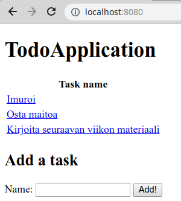
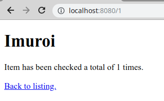
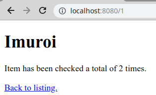

<text-box variant='learningObjectives' name='Oppimistavoitteet'>

- Tiedät, että polkuja käytetään resurssien tunnistamiseen.
- Tunnet käsitteen polkumuuttuja.
- Osaat määritellä pyyntöjä käsitteleviin metodeihin polkumuuttujia.
- Osaat käyttää polkumuuttujia tietokantaa käyttävissä web-sovelluksissa.

</text-box>


Polkuja käytetään resurssien tunnistamiseen ja yksilöintiin. Usein vastaan tulee tilanne, missä luodut resurssit ovat uniikkeja, emmekä tiedä niiden tietoja ennen sovelluksen käynnistymistä -- emme voi siis määritellä eksaktia polkua, joka tunnistaisi vielä tuntemattoman resurssin.

Yksi vaihtoehto tällaisen tilanteen ratkaisemiseksi on kontrolleriluokassa olevan metodin määrittely siten, että metodi käsittelee aina tiettyyn polkuun tulevat pyynnöt, ja pyynnön mukana tulevalla parametrilla tunnistetaan resurssit. Esimerkiksi pyyntö polkuun `/henkilot?id=3` näyttäisi tietokannasta sen henkilön tiedot, jonka `id`-sarakkeen arvo on `3`.

Toinen vaihtoehto on ajatella polkua haettavan resurssin tunnistajana. Annotaatiolle `@GetMapping` määriteltävään polkuun voidaan määritellä polkumuuttuja aaltosulkujen avulla. Esimerkiksi polku `"/{arvo}"` ottaisi vastaan minkä tahansa juuripolun alle tulevan kyselyn ja tallentaisi arvon myöhempää käyttöä varten. Tällöin jos käyttäjä tekee pyynnön esimerkiksi osoitteeseen `http://localhost:8080/kirja`, tallentuu arvo "kirja" myöhempää käyttöä varten. Polkumuuttujiin pääsee käsiksi pyyntöä käsittelevälle metodille määriteltävän annotaation <a href="http://docs.spring.io/spring/docs/current/javadoc-api/org/springframework/web/bind/annotation/PathVariable.html" target="_blank">@PathVariable</a> avulla.

<br/>

Jatketaan aiemman henkilöesimerkin kanssa. Nyt yksittäisen henkilön hakeminen onnistuisi esimerkiksi seuraavalla tavalla.

```java
@Controller
public class HenkiloController {

    @Autowired
    private HenkiloRepository henkiloRepository;

    @GetMapping("/")
    public String list(Model model) {
        model.addAttribute("list", henkiloRepository.findAll());
        return "henkilot"; // tässä oletetaan erillinen tiedosto henkilot.html
    }

    @PostMapping("/")
    public String create(@RequestParam String nimi) {
        henkiloRepository.save(new Henkilo(nimi));
        return "redirect:/";
    }

    @GetMapping("/{id}")
    public String getOne(Model model, @PathVariable Long id) {
        model.addAttribute("henkilo", henkiloRepository.getOne(id));
        return "henkilo";
    }
}
```

Yllä olevassa esimerkissä metodi `getOne` käsittelee pyyntöjä ennalta määrittelemättömään osoitteeseen `/{id}`. Tässä `{id}` tarkoittaa käytännössä sitä, että Spring ottaa polusta osan talteen ja asettaa sen pyynnön käsittelevän metodin `id`-nimiseen muuttujaan, jolle on määritelty `@PathVariable`-annotaatio. Kun metodia kutsutaan, se saa parametrinaan polkuun asetetun muuttujan, joka muunnetaan Long-tyyppiseksi. Metodissa haetaan tietokantataulusta Henkilo rivi pääavaimen `id` perusteella -- palautettu arvo lisätään Modeliin, jonka jälkeen tietokannasta haettu tieto näytetään osana `henkilo.html`-tiedostoa.


<programming-exercise name='Hello Path Variables' tmcname='osa02-Osa02_10.HelloPathVariables'>

Tehtäväpohjassa on sovellus, jossa käsitellään `Item`-tyyppisiä olioita. Kun sovelluksen juureen tehdään pyyntö, käyttäjälle näytetään oletushattu ("default"). Tehtäväpohjaan on määritelty hajautustaulu, joka sisältää erilaisia hattuja.

Lisää sovellukseen toiminnallisuus, jonka avulla käyttäjä voi hakea hajautustaulusta hattuja. Esimerkiksi, mikäli käyttäjä tekee pyynnön polkuun `/ascot`, tulee hänelle näyttää hatun `Ascot cap` tiedot. Vastaavasti, jos käyttäjä tekee pyynnön polkuun `/bicorne`, tulee käyttäjälle näyttää hatun `Bicorne` tiedot.

Luo siis uusi pyyntöjä käsittelevä metodi, joka käsittelee ennalta määräämättömän muotoisiin polkuihin tehtyjä pyyntöjä, ja palauttaa pyynnön polun perusteella käyttäjälle hatun tiedot. Käytä tässä polkumuuttujan tyyppinä merkkijonoa.

Sovelluksen juuripolkuun tehtävä pyyntö näyttää seuraavanlaisen sivun:


Muihin osoitteisiin tehtävät pyynnöt taas palauttavat tehtäväpohjassa olevasta `items`-hajautustaulusta polkuun sopivan hatun. Esimerkiksi pyyntö polkuun `/ascot` näyttää seuraavanlaisen sivun:


</programming-exercise>


<programming-exercise name='Hello Individual Pages' tmcname='osa02-Osa02_11.HelloIndividualPages'>

Edellisessä tehtävässä käytössämme oli vain yksi sivu. Olisi kuitenkin hienoa, jos jokaiselle hatulle olisi oma sivu -- ainakin sovelluksen käyttäjän näkökulmasta. Tehtäväpohjassa on valmiina sovellus, joka listaa olemassaolevat hatut ja näyttää ne käyttäjälle. Jokaisen hatun yhteydessä on linkki, jota klikkaamalla pitäisi päästä hatun omalle sivulle.

Toteuta tehtäväpohjaan uusi yhden hatun tiedot näyttävä html-sivu (`single.html`) ja metodi, joka ohjaa pyynnön sivulle. Kuten edellisessä tehtävässä, metodin tulee kuunnella ennalta määräämättömän muotoisuu polkuihin tehtyjä pyyntöjä, ja palauttaa pyynnön polun perusteella käyttäjälle hattu. Huom! Toisin kuin edellisessä tehtävässä, tässä tehtävässä hatun tunnistamiseen käytettävä merkkijono luodaan hatun luomisen yhteydessä.

Pyyntö sovelluksen juureen luo seuraavanlaisen sivun.


Jos sivulta klikkaa hattua, pääsee tietyn hatun tiedot sisältävälle sivulle. Alla olevassa esimerkissä on klikattu taikurin hattuun liittyvää linkkiä.


</programming-exercise>


<programming-exercise name='Todo Application (2 osaa)' tmcname='osa02-Osa02_12.TodoApplication'>

Tässä tehtävässä tulee rakentaa tietokantaa käyttävä tehtävien hallintaan tarkoitettu sovellus. Sovelluksen käyttämät html-sivut ovat valmiina, sovelluksen muut osat pääset toteuttamaan itse.

Sovellukseen tulee lisätä seuraavat toiminnallisuudet:

- Kaikkien tehtävien listaaminen. Kun käyttäjä tekee pyynnön sovelluksen juuripolkuun, tulee hänelle näyttää sivu, missä tehtävät on listattuna. Tehtäväpohjan mukana tuleva HTML-sivu sisältää tiedon Modeliin lisättävän listan nimestä sekä valmiin HTML-lomakkeen.

- Yksittäisen tehtävän lisääminen. Kun käyttäjä täyttää lomakkeen ja lähettää tiedot palvelimelle, tulee sovelluksen lisätä tehtävä näytettävään listaan.

- Yksittäisen tehtävän näyttäminen. Kun käyttäjä klikkaa tehtävään liittyvää linkkiä, tulee käyttäjälle näyttää yhden tehtävän tiedot näyttävä sivu. Tämän lisäksi, tehtävän näyttämisen yhteydessä, tehtävään liittyvien tarkastusten eli katselukertojen määrän tulee kasvaa yhdellä. Toteuta tämä niin, että haet tietokannasta olion (rajapinnan metodi `getOne`), päivität siihen liittyvää katselukertoja kuvaavan muuttujan arvoa, ja tallennat olion tietokantaan (rajapinnan metodi `save`).

Alla kuva tehtävien listauksesta:



Kun tehtävää klikkaa, näytetään erillinen tehtäväsivu:



Kun sivu avataan toisen kerran, kasvaa tehtävien tarkistukseen liittyvä laskuri:



Tehtävä on kahden yksittäisen tehtäväpisteen arvoinen.

</programming-exercise>

