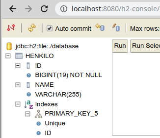
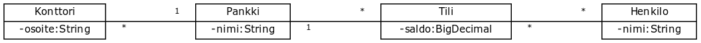
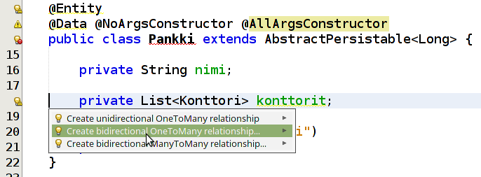
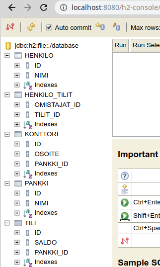
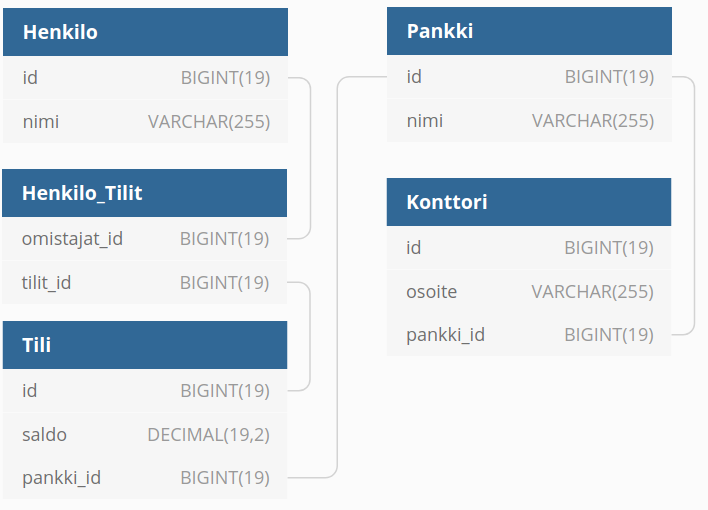
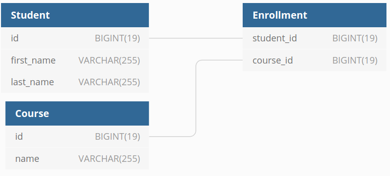
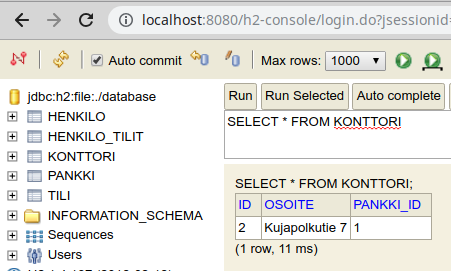

<text-box variant='learningObjectives' name='Oppimistavoitteet'>

- Osaat määritellä tietokantatauluja sekä tietokantataulujen välisiä yhteyksiä.
- Tiedät mitä annotaatiot `@ManyToMany`, `@ManyToOne` ja `@OneToMany` tarkoittavat, ja tiedät mitä annotaatioille annettava parametri `mappedBy` tarkoittaa.
- Osaat tallentaa tietokantaan olioita, jotka viittaavat toisiin olioihin.

</text-box>


Otimme edellisessä osassa ensiaskeleet tietokantojen käyttöön. Sovelluksemme ovat tähän mennessä luoneet ja käyttäneet yhtä tietokantataulua -- yhden tietokantataulun käyttö vaatii tietokantataulua kuvaavan entiteetin luomisen ja tietokantataulua käsittelevän rajapinnan luomisen.

Edellisessä osassa käsittelimme mm. henkilöä.

```java
// pakkaus ja importit

@Entity
@Data @NoArgsConstructor @AllArgsConstructor
public class Henkilo extends AbstractPersistable<Long> {

    private String nimi;
}
```

Yllä oleva määrittely luo tietokantataulun, johon on määritelty sekä pääavain `id` että sarake `nimi`. Sarakkeiden tyypit riippuvat hieman käytetystä tietokannanhallintajärjestelmästä. Käyttämässämme H2-tietokannanhallintajärjestelmässä sarakkeen `id` tyypiksi määritellään oletuksena `BIGINT` ja sarakkeen `nimi` tyypiksi määritellään oletuksena `VARCHAR` -- automaattisesti luotujen taulujen tarkemmat tiedot löytyvät tietokannasta, jota voi tarkastella mm. H2-tietokannanhallintajärjestelmän konsolista kun entiteetin sisältävä sovellus on käynnissä.



Tietokannan käsittelyyn käytetään Springin tarjoamaa `JpaRepository`-abstraktiota. Kun käytämme `JpaRepository`-rajapintaa oman toteutuksemme pohjana, saamme yksinkertaiset tietokantaoperaatiot käyttöömme hyvin helposti.

```java
// pakkaus

import domain.Henkilo;
import org.springframework.data.jpa.repository.JpaRepository;

public interface HenkiloRepository extends JpaRepository<Henkilo, Long> {

}
```

Aloitamme nyt useamman tietokantataulun sisältävän sovelluksen toteutuksen ja tarkastelun. Sovelluksen teemana on pankkijärjestelmä.

## Pankkijärjestelmä

Pankkijärjestelmässämme on henkilöitä, tilejä, pankkeja sekä pankkien konttoreita. Jokaisella henkilöllä on yksi tai useampi tili, ja jokaisella tilillä voi olla yksi tai useampi omistaja. Tili liittyy aina tiettyyn pankkiin ja pankissa voi olla useampia tilejä. Pankilla on konttoreita ja jokainen konttori liittyy tiettyyn pankkiin.

Pankkijärjestelmämme käsitteet ja niiden yhteydet ovat luokkakaaviossa seuraavat.




<br/>

Koska liukuluvut ovat epätarkkoja, käytämme tilin saldon näyttämiseen Javan <a href="https://docs.oracle.com/javase/8/docs/api/java/math/BigDecimal.html" target="_blank">BigDecimal</a>-luokkaa. H2-tietokannanhallintajärjestelmässä tämä muuntuu SQL:n DECIMAL-tyypiksi.

<br/>

Luokkina käsitteet näyttävät seuraavilta.

```java
public class Konttori {

    private String osoite;
    private Pankki pankki;

}
```
```java
public class Pankki {

    private String nimi;
    private List<Konttori> konttorit = new ArrayList<>();
    private List<Tili> tilit = new ArrayList<>();

}
```
```java
public class Tili {

    private BigDecimal saldo = new BigDecimal(0);
    private Pankki pankki;
    private List<Henkilo> omistajat = new ArrayList<>();

}
```
```java
public class Henkilo {

    private String nimi;
    private List<Tili> tilit = new ArrayList<>();

}
```

Listat on luokissa alustettu `ArrayList`-tyyppisiksi ja `BigDecimal`-muuttujan arvoksi on asetettu oletusarvona 0. Tämä tehdään sen takia, että vältämme `null`-viitteiden tallentamista tietokantaan.

## Luokista tietokantatauluiksi

Aloitetaan luokkien määrittely tietokantatauluiksi. Muistamme edellisestä osasta, että jokainen tietokantatauluksi muunnettava luokka tulee määritellä `@Entity`-annotaation avulla. Perimme jokaisella luokalla luokan `AbstractPersistable`, jolloin annamme vastuun tietokantataulun pääavaimen määrittelystä käyttämällemme sovelluskehykselle.

Alla jokaiselle luokalle on edellä mainittujen lisäysten lisäksi määritelty Lombokin vaatimat annotaatiot, jolloin luokilla on valmiina konstruktorit, getterit ja setterit, hashCodet ymym.


```java
@Entity
@Data @NoArgsConstructor @AllArgsConstructor
public class Konttori extends AbstractPersistable<Long> {

    private String osoite;
    private Pankki pankki;

}
```
```java
@Entity
@Data @NoArgsConstructor @AllArgsConstructor
public class Pankki extends AbstractPersistable<Long> {

    private String nimi;
    private List<Konttori> konttorit = new ArrayList<>();
    private List<Tili> tilit = new ArrayList<>();

}
```
```java
@Entity
@Data @NoArgsConstructor @AllArgsConstructor
public class Tili extends AbstractPersistable<Long> {

    private BigDecimal saldo = new BigDecimal(0);
    private Pankki pankki;
    private List<Henkilo> omistajat = new ArrayList<>();

}
```
```java
@Entity
@Data @NoArgsConstructor @AllArgsConstructor
public class Henkilo extends AbstractPersistable<Long> {

    private String nimi;
    private List<Tili> tilit = new ArrayList<>();

}
```

Mikäli käynnistäisimme sovelluksemme tällä hetkellä, se ei toimisi. Tämä johtuu siitä, että emme vielä kerro miten tietokantataulujen väliset yhteydet tulee toteuttaa.


## Yhteydet ja osallistumisrajoitteet tietokantataulujen välillä

Osallistumisrajoitteet -- yksi moneen (one to many), moni yhteen (many to one), moni moneen (many to many) lisätään annotaatioiden avulla.

Totesimme aiemmin, että jokaisella henkilöllä on yksi tai useampi tili, ja jokaisella tilillä voi olla yksi tai useampi omistaja. Tili liittyy aina tiettyyn pankkiin ja pankissa voi olla useampia tilejä. Pankilla on konttoreita, ja jokainen konttori liittyy tiettyyn pankkiin. Tämä tarkoittaa seuraavaa:

- Henkilöllä ja tilillä on monesta moneen -yhteys.
- Tilillä ja pankilla on monesta yhteen -yhteys. Käänteisesti pankilla ja tilillä on yhdestä moneen -yhteys.
- Pankilla ja konttorilla on yhdestä moneen -yhteys. Käänteisesti konttorilla ja pankilla on monesta yhteen -yhteys.

Näitä yhteyksiä kuvataan annotaatioilla `@ManyToMany`, `@ManyToOne` ja `@OneToMany`.

Lisätään annotaatiot luokkiimme.


```java
@Entity
@Data @NoArgsConstructor @AllArgsConstructor
public class Konttori extends AbstractPersistable<Long> {

    private String osoite;
    @ManyToOne
    private Pankki pankki;

}
```
```java
@Entity
@Data @NoArgsConstructor @AllArgsConstructor
public class Pankki extends AbstractPersistable<Long> {

    private String nimi;
    @OneToMany
    private List<Konttori> konttorit = new ArrayList<>();
    @OneToMany
    private List<Tili> tilit = new ArrayList<>();

}
```
```java
@Entity
@Data @NoArgsConstructor @AllArgsConstructor
public class Tili extends AbstractPersistable<Long> {

    private BigDecimal saldo = new BigDecimal(0);
    @ManyToOne
    private Pankki pankki;
    @ManyToMany
    private List<Henkilo> omistajat = new ArrayList<>();

}
```
```java
@Entity
@Data @NoArgsConstructor @AllArgsConstructor
public class Henkilo extends AbstractPersistable<Long> {

    private String nimi;
    @ManyToMany
    private List<Tili> tilit = new ArrayList<>();

}
```

Yllä olevassa esimerkissä luokat eivät vielä kerro sovelluskehykselle _mihin_ liitos tulee tehdä. Sovelluskehys ei esimerkiksi tiedä, että henkilön tilit kytkeytyvät tilin omistajiin.

Loppusilaus on `mappedBy`-määreen lisääminen. Määreellä kerrotaan mihin toisen luokan muuttujaan arvot kytketään ja kuka yhteyden omistaa -- yhteyden omistaa aina `mappedBy`-määreen määrittelemä muuttuja, eli ei se muuttuja, jonka yläpuolella olevassa annotaatiossa esiintyy `mappedBy`-määre.

Haluamme kytkeä luokan Henkilo muuttujan tilit luokan Tili muuttujaan omistajat. Vastaavasti haluamme kytkeä luokan Pankki muuttujan konttorit luokan Konttori muuttujaan pankki, ja luokan pankki muuttuja tilit luokan Tili muuttujaan pankki. Määre `mappedBy` asetetaan vain toiseen yhteyden päädyistä, ei kumpaankin.


Lopulta luokkamme näyttävät seuraavilta.


```java
@Entity
@Data @NoArgsConstructor @AllArgsConstructor
public class Konttori extends AbstractPersistable<Long> {

    private String osoite;
    @ManyToOne
    private Pankki pankki;

}
```
```java
@Entity
@Data @NoArgsConstructor @AllArgsConstructor
public class Pankki extends AbstractPersistable<Long> {

    private String nimi;
    @OneToMany(mappedBy = "pankki")
    private List<Konttori> konttorit = new ArrayList<>();
    @OneToMany(mappedBy = "pankki")
    private List<Tili> tilit = new ArrayList<>();

}
```
```java
@Entity
@Data @NoArgsConstructor @AllArgsConstructor
public class Tili extends AbstractPersistable<Long> {

    private BigDecimal saldo = new BigDecimal(0);
    @ManyToOne
    private Pankki pankki;
    @ManyToMany(mappedBy = "tilit")
    private List<Henkilo> omistajat = new ArrayList<>();

}
```
```java
@Entity
@Data @NoArgsConstructor @AllArgsConstructor
public class Henkilo extends AbstractPersistable<Long> {

    private String nimi;
    @ManyToMany
    private List<Tili> tilit = new ArrayList<>();

}
```


<text-box variant='hint' name='@OneToMany ja @ManyToMany -annotaatiot'>


Kun kirjoitat NetBeansissa viitteen entiteettiluokasta toiseen, ohjelmointiympäristö tarjoaa mahdollisuuden viittauksen tyypin automaattiseen luomiseen. Viittauksen tyypin voi luoda klikkaamalla viitteen määrittelevän rivin vasemmalla puolella olevaa keltaista palloa klikkaamalla.

Alla olevassa kuvassa on klikattu rivin `private List<Konttori> konttorit;` vasemmalla olevaa keltaista palloa. Tämä avaa valikon, josta yhteyden tyypin voi valita automaattisesti.



Tutustu tähän toiminnallisuuteen, sillä se helpottaa työtäsi jatkossa merkittävästi.

</text-box>

Kun yllä luotu sovellus käynnistetään, ohjelma luo automaattisesti tietokantataulut. H2-tietokannanhallintajärjestelmän konsolissa tietokantataulun näyttävät seuraavilta.



Tietokantakaaviona tietokantamme on seuraavanlainen.



Kuten huomaamme, tietokannassa on vielä muutamia hassuuksia. Automaattisesti luotu liitostaulu `Henkilo_Tilit` ja sen sarakkeet eivät ole ideaaleimmalla tavalla nimetyt. Mikäli haluaisimme muuttaa näiden nimiä, muutokset tehtäisiin annotaatioilla <a href="https://docs.oracle.com/javaee/7/api/javax/persistence/JoinColumn.html" target="_blank">@JoinColumn</a> ja <a href="https://docs.oracle.com/javaee/7/api/javax/persistence/JoinTable.html" target="_blank">@JoinTable</a>.

<br/>


<programming-exercise name='New Tables' tmcname='osa03-Osa03_01.NewTables'>

Luo sovellukseen toiminnallisuus, jonka avulla sovelluksessa luodaan kaksi tietokantataulua sekä niiden välinen liitostaulu. Tietokantataulujen nimien tulee olla `Student` ja `Course`. Liitostaulun nimen tulee olla `Enrollment`.

Tietokantataulussa `Student` tulee olla sarakkeet `id`, `first_name` ja `last_name`. Tietokantataulussa `Course` tulee olla sarakkeet `id` ja `name`. Liitostaulussa `Enrollment` tulee olla sarakkeet `course_id` ja `student_id`, jotka ovat nimensä mukaisesti viiteavaimia taulujen `Course` ja `Student` pääavaimiin.

Tietokantakaaviona lopputilanteen tulee olla seuraavanlainen.

 Student.id } Ref { Enrollment.course_id > Course.id }"/>

Hyödyt sarakkeiden nimeämisessä annotaatioista `@Column`, `@JoinColumn` ja `@JoinTable`. Kannattaa käyttää H2-tietokannanhallintajärjestelmän konsolia tietokannan tarkasteluun -- tietokannan voi tyhjentää poistamalla tehtäväpohjassa olevat `database`-alkuiset tiedostot.

</programming-exercise>


<text-box variant="hint" name="MappedBy">

Annotaatioille `@OneToMany`, `@ManyToOne` ja niin edelleen määriteltävä määre `mappedBy` kertoo yhteyden omistavan olion. Määrettä tarvitaan vain, mikäli yhteys määritellään luokkiin kaksisuuntaisesti eli mikäli luokka A sisältää listan luokan B olioita ja luokka B listan luokan A olioita. Mikäli yhteys on yksisuuntainen, määrettä `mappedBy` ei tarvita lainkaan.


</text-box>


## Tietokantataulujen käsittely ohjelmallisesti

Useamman tietokantataulun käsittely ei juurikaan poikkea yhden tietokantataulun käsittelystä. Luomme jokaiselle entiteetille taulun käsittelyyn tarkoitetun rajapinnan ja hyödynnämme näitä rajapintoja osana sovellustamme.

Alla on kuvattuna konttorille, pankille, tilille ja henkilölle luodut `JpaRepository`-rajapinnan perivät tietokannan käsittelyyn tarkoitetut rajapinnat.

```java
public interface KonttoriRepository extends JpaRepository<Konttori, Long> {

}
```
```java
public interface PankkiRepository extends JpaRepository<Pankki, Long> {

}
```
```java
public interface TiliRepository extends JpaRepository<Tili, Long> {

}
```
```java
public interface HenkiloRepository extends JpaRepository<Henkilo, Long> {

}
```

Tietokantataulun rivejä kuvaavien olioiden väliset viitteet luodaan ohjelmallisesti.

### Yhdestä moneen -yhteyden lisääminen ohjelmallisesti

Tarkastellaan ensin yhdestä moneen -yhteyden lisäämistä ohjelmallisesti. Yhdestä moneen -yhteydet lisätään tyypillisesti siten, että viite määritellään "moneen"-päätyyn eli esimerkiksi konttorin päätyyn kun pankille lisätään konttoria.

Kun uutta konttoria luodaan, konttorille annetaan parametrina tieto pankista, johon konttori liittyy. Kun konttori tallennetaan, parametrina saadun pankin pääavain tallennetaan konttorin pankkiin viittaavaksi viiteeksi.

Oletetaan, taulussa `Pankki` on rivi, jonka pääavaimen arvo on `1`. Uuden `Konttori`-olion ja `Konttori`-taulun rivin luominen tapahtuu seuraavasti.

```java
@Autowired
private PankkiRepository pankkiRepository;
@Autowired
private KonttoriRepository konttoriRepository;

@GetMapping("/esimerkki")
public String lisaaKonttori() {
    Pankki p = pankkiRepository.getOne(1L);
    Konttori k = new Konttori("Kujapolkutie 7", p);
    konttoriRepositoty.save(k);
}

```

Yllä haemme ensin pankki-olion, jonka asetamme sitten konttorin pankiksi. Kun yllä kuvattua metodia kutsutaan, tietokannan `Konttori`-tauluun lisätään rivi, joka sisältää yllä kuvatun konttoriolion tiedot.




#### Pankkien ja konttorien käsittely

Tarkastellaan edellä nähtyä yhdestä moneen -yhteyden lisäämistä osana pankkijärjestelmäämme.

Pankkien ja konttorien lisäys on järjestelmässämme toteutettu siten, että pankkeihin liittyviä pyyntöjä käsittelevä luokka `PankkiController` tarjoaa pääsyn pankin tietoihin sekä mahdollisuuden konttorien lisäämiseen. Alla kuvattu luokka `PankkiController` käsittelee polkuun `/pankit` tulevia pyyntöjä seuraavasti:

- GET-tyyppinen pyyntö polkuun `/pankit` listaa kaikki tietokannassa olevat pankit.
- POST-tyyppinen pyyntö polkuun `/pankit` lisää pankin tietokantaan.
- GET-tyyppinen pyyntö polkuun `/pankit/{id}` hakee ja näyttää tietyn pankin tiedot.
- POST-tyyppinen pyyntö polkuun `/pankit/{id}/konttorit` luo polkuparametrin avulla määritellylle pankille uuden konttorin.

```java

@Controller
public class PankkiController {

    @Autowired
    private PankkiRepository pankkiRepository;
    @Autowired
    private KonttoriRepository konttoriRepository;

    @GetMapping("/pankit")
    public String list(Model model) {
        model.addAttribute("pankit", pankkiRepository.findAll());
        return "pankit";
    }

    @PostMapping("/pankit")
    public String create(@RequestParam String nimi) {
        pankkiRepository.save(new Pankki(nimi, new ArrayList<>(), new ArrayList<>()));
        return "redirect:/pankit";
    }

    @GetMapping("/pankit/{id}")
    public String getOne(Model model, @PathVariable Long id) {
        model.addAttribute("pankki", pankkiRepository.getOne(id));
        return "pankki";
    }

    @PostMapping("/pankit/{id}/konttorit")
    public String addKonttori(@PathVariable Long id, @RequestParam String osoite) {
        Pankki p = pankkiRepository.getOne(id);
        Konttori k = new Konttori(osoite, p);
        konttoriRepository.save(k);
        return "redirect:/pankit/" + id;
    }
}
```

Tarkastellaan seuraavaksi toiminnallisuuden toteuttamiseen tarvittavia HTML-sivuja.  Sivuilla on käytetty Thymeleafin syntaksia polkumuuttujien lisäämiseen osaksi osoitteita. Tästä tarkemmin mm. <a href="https://www.thymeleaf.org/doc/articles/standardurlsyntax.html" target="_blank">Thymeleafin dokumentaatiossa</a>.

<br/>

Sivu `pankit.html` sisältäisi toiminnallisuuden pankkien listaamiseen sekä lomakkeen uuden pankin lisäämiseen.

```html
<!DOCTYPE html>
<html xmlns="http://www.w3.org/1999/xhtml" xmlns:th="http://www.thymeleaf.org">
    <head>
        <title>Pankit</title>
    </head>

    <body>
        <h1>Pankit</h1>

        <ul>
            <li th:each="pankki: ${pankit}">
                <a th:href="@{/pankit/{id}(id=${pankki.id})}">
                    <span th:text="${pankki.nimi}">pankin nimi</span>
                </a>
            </li>
        </ul>

        <h2>Luo uusi</h2>

        <form th:action="@{/pankit}" method="POST">
            <input type="text" name="nimi"/>
            <input type="submit" value="Lisää!"/>
        </form>
    </body>
</html>
```

Vastaavasti sivu `pankki.html` sisältäisi toiminnallisuuden pankin tietojen näyttämiseen sekä lomakkeen uuden konttorin luomiseen.

```html
<!DOCTYPE html>
<html xmlns="http://www.w3.org/1999/xhtml" xmlns:th="http://www.thymeleaf.org">
    <head>
        <title th:text="${pankki.nimi}">Pankin nimi</title>
    </head>

    <body>
        <h1 th:text="${pankki.nimi}">Pankin nimi</h1>

        Pankin konttorit:
        <ul>
            <li th:each="konttori: ${pankki.konttorit}">
                <span th:text="${konttori.osoite}">Konttorin osoite</span>
            </li>
        </ul>

        <h2>Luo uusi konttori</h2>

        <form th:action="@{/pankit/{id}/konttorit(id=${pankki.id})}" method="POST">
            <input type="text" name="osoite"/>
            <input type="submit" value="Lisää!"/>
        </form>
    </body>
</html>
```

Yllä olevalla yksittäisen pankin näyttämistä kuvaavalla sivulla näemme hyvin mielenkiintoisen tapahtuman. Sivulla listataan pankkeihin liittyvät konttorit, mutta konttoreita ei ole haettu tietokannasta -- ainakaan eksplisiittisesti.

Kun Thymeleaf kohtaa komennon `<li th:each="konttori: ${pankki.konttorit}">`, se kutsuu "pankki"-avaimella `Model`-olioon lisätyn `Pankki`-olion metodia `getKonttorit()`. Tämä johtaa siihen, että tietokannasta haetaan pankkiin liittyvät konttorit, jotka käydään sivulla yksitellen läpi. Tiedot haetaan tietokannasta oletuksena vasta kun niitä tarvitaan -- palaamme tämän toiminnan tietokantojen perusteistakin tuttuihin hyötyihin ja haittoihin myöhemmin.


<programming-exercise name='Simple Banking' tmcname='osa03-Osa03_02.SimpleBanking'>


Sovelluksessa on toteutettuna entiteetit tilien ja asiakkaiden hallintaan, mutta niiden väliltä puuttuu kytkös. Muokkaa sovellusta siten, että asiakkaalla voi olla monta tiliä, mutta jokaiseen tiliin liittyy tasan yksi asiakas.

Tilin ja asiakkaan välisen yhteyden luomisen lisäksi tilin lisäämisen tulee kytkeä tili asiakkaaseen. Alla olevassa esimerkissä tietokannassa on kaksi asiakasta ja kolme tiliä.


</programming-exercise>


### Monesta moneen -yhteyden lisääminen ohjelmallisesti


Monesta moneen -yhteyden lisääminen tietokantaan onnistuu lähes yhtä suoraviivaisesti. Tarkastellaan henkilöiden ja tilien suhdetta -- yhdellä henkilöllä voi olla monta tiliä, ja tilillä voi olla monta omistajaa. Tietokantataulut määriteltiin seuraavalla tavalla.

```java
@Entity
@Data @NoArgsConstructor @AllArgsConstructor
public class Tili extends AbstractPersistable<Long> {

    private BigDecimal saldo = new BigDecimal(0);
    @ManyToOne
    private Pankki pankki;
    @ManyToMany(mappedBy = "tilit")
    private List<Henkilo> omistajat = new ArrayList<>();

}
```
```java
@Entity
@Data @NoArgsConstructor @AllArgsConstructor
public class Henkilo extends AbstractPersistable<Long> {

    private String nimi;
    @ManyToMany
    private List<Tili> tilit = new ArrayList<>();

}
```

Yllä tilin ja henkilön välillä on monesta moneen -suhde. `Tili`-luokassa määritelty `mappedBy`-muuttuja kertoo, että suhteen omistaa luokan `Henkilo` `tilit`-muuttuja. Omistajuus on monesta moneen -yhteyksissä tärkeä käsite -- tietokantaan tallennetaan yhteyden omistavan muuttujan sisältö.

Oletetaan, että haluamme lisätä tilille uuden henkilön. Tilin id on `3` ja henkilön id on `7`. Alla on ensimmäinen yritys.

```java
@Autowired
private HenkiloRepository henkiloRepository;

@Autowired
private TiliRepository tiliRepository;

@GetMapping("/lisaaomistaja")
public String lisaaOmistaja() {
    Tili t = tiliRepository.getOne(3L);
    Henkilo h = henkiloRepository.getOne(7L);

    t.getOmistajat().add(h);
    tiliRepository.save(t);
}
```

Metodi `lisaaOmistaja` hakee tilin ja henkilön, lisää henkilön tilin omistajiin, ja tallentaa tilin.

Tämä muutos ei kuitenkaan vaikuta millään tavalla tietokantaan, sillä tili ei omista monesta moneen -yhteyttä. `Tili`-luokassa kuvatun `mappedBy`-määreen mukaan yhteyden omistaa `Henkilo`-luokan `tilit`-muuttuja.

Toteutetaan metodi uudestaan.

```java
@Autowired
private HenkiloRepository henkiloRepository;

@Autowired
private TiliRepository tiliRepository;

@GetMapping("/lisaaomistaja")
public String lisaaOmistaja() {
    Tili t = tiliRepository.getOne(3L);
    Henkilo h = henkiloRepository.getOne(7L);

    h.getTilit().add(t);
    henkiloRepository.save(h);
}
```

Nyt lisäys tapahtuu oikeaan muuttujaan ja yhteys tilin ja henkilön välille lisätään liitostauluun tallennuksen yhteydessä.

#### Tilien ja omistajien käsittely

Tarkastellaan tilien lisäämistä pankkisovelluksessamme. Luokkaa `TiliController` käytetään tilien lisäämiseen ja listaamiseen sekä tilien omistajien lisäämiseen. Alla kuvattu luokka `TiliController` käsittelee polkuun `/tilit` tulevia pyyntöjä seuraavasti:

- GET-tyyppinen pyyntö osoitteeseen `/tilit` listaa kaikki tilit sekä tarjoaa mahdollisuuden tilin lisäämiseen. Tilin lisäämisessä tarjotaan mahdollisuus pankin valintaan.
- POST-tyyppinen pyyntö osoitteeseen `/tilit` lisää tilin. Pyyntö sisältää pankin tunnuksen pyyntöparametrina.
- GET-tyyppinen pyyntö osoitteeseen `/tilit/{id}` näyttää tietyn tilin tiedot. Tilin tiedot näyttävä sivu mahdollistaa myös omistajien lisäämisen tilille.
- POST-tyyppinen pyyntö osoitteeseen `/tilit/{tiliId}/omistajat/{henkiloId}` lisää polkumuuttujassa annetulle tilille toisessa polkumuuttujassa lisätyn omistajan.

*Huom! Tässä oiotaan hieman -- koska tilit liittyvät aina tiettyyn pankkiin, todellisuudessa tilien hallinta tehtäisiin todennäköisemmin pankkiin liittyvän polun alta, esim. `/pankit/{pankkiId}/tilit`.*

```java
@Controller
public class TiliController {

    @Autowired
    private TiliRepository tiliRepository;

    @Autowired
    private HenkiloRepository henkiloRepository;

    @Autowired
    private PankkiRepository pankkiRepository;

    @GetMapping("/tilit")
    public String list(Model model) {
        model.addAttribute("tilit", tiliRepository.findAll());
        model.addAttribute("pankit", pankkiRepository.findAll());
        return "tilit";
    }

    @PostMapping("/tilit")
    public String create(@RequestParam Long pankkiId) {
        Pankki p = pankkiRepository.getOne(pankkiId);
        Tili t = new Tili(new BigDecimal(0), p, new ArrayList<>());
        tiliRepository.save(t);
        return "redirect:/tilit";
    }

    @GetMapping("/tilit/{id}")
    public String getOne(Model model, @PathVariable Long id) {
        Tili tili = tiliRepository.getOne(id);
        List<Henkilo> henkilot = henkiloRepository.findAll();
        henkilot.removeAll(tili.getOmistajat());

        model.addAttribute("tili", tili);
        model.addAttribute("henkilot", henkilot);

        return "tili";
    }

    @PostMapping("/tilit/{tiliId}/omistajat/{henkiloId}")
    public String addOmistaja(@PathVariable Long tiliId, @PathVariable Long henkiloId) {
        Tili tili = tiliRepository.getOne(tiliId);
        Henkilo henkilo = henkiloRepository.getOne(henkiloId);

        henkilo.getTilit().add(tili);
        henkiloRepository.save(henkilo);

        return "redirect:/tilit/" + tiliId;
    }
}
```

Tarkastellaan seuraavaksi toiminnallisuuden toteuttamiseen tarvittavia HTML-sivuja.

Sivu `tilit.html` sisältäisi toiminnallisuuden tilien listaamiseen sekä uuden tilin lisäämiseen.

```html
<!DOCTYPE html>
<html xmlns="http://www.w3.org/1999/xhtml" xmlns:th="http://www.thymeleaf.org">
    <head>
        <title>Tilit</title>
    </head>

    <body>
        <h1>Tilit</h1>

        <ul>
            <li th:each="tili: ${tilit}">
                <a th:href="@{/tilit/{id}(id=${tili.id})}">
                    <span th:text="${tili.id + ' ' + tili.saldo}">tilin id ja saldo</span>
                </a>
            </li>
        </ul>

        <h2>Luo uusi</h2>

        <form th:action="@{/tilit}" method="POST">
            <select name="pankkiId">
                <option th:each="pankki : ${pankit}"
                        th:text="${pankki.nimi}"
                        th:value="${pankki.id}">
                    Pankin nimi
                </option>
            </select>
            <input type="submit" value="Lisää!"/>
        </form>
    </body>
</html>
```

Vastaavasti sivu `tili.html` sisältäisi toiminnallisuuden tilin tietojen näyttämiseen sekä mahdollisuuden uuden omistajan lisäämiseen.

```html
<!DOCTYPE html>
<html xmlns="http://www.w3.org/1999/xhtml" xmlns:th="http://www.thymeleaf.org">
    <head>
        <title th:text="${tili.id}">Tilin id</title>
    </head>

    <body>
        <h1 th:text="${'Tili ' + tili.id}">Tilin tunnus</h1>

        <p>
            Saldo: <span th:text="${tili.saldo}">0</span>.
        </p>
        <p>
            Pankki: <span th:text="${tili.pankki.nimi}">Pankin nimi</span>.
        </p>

        <p>
            Tilin omistajat
        </p>
        <ul>
            <li th:each="henkilo: ${tili.omistajat}">
                <span th:text="${henkilo.nimi}">Omistajan nimi</span>
            </li>
        </ul>

        <h2>Lisää uusi omistaja</h2>
        <ul>
            <li th:each="henkilo: ${henkilot}">
                <form th:action="@{/tilit/{id}/omistajat/{omistajaId}(id=${tili.id},omistajaId=${henkilo.id})}" method="POST">
                    <input type="submit" th:value="${'Lisää omistajaksi ' + henkilo.nimi}"/>
                </form>
            </li>
        </ul>

    </body>
</html>
```

<quiz id="6e5a2b30-6d25-54fc-b6dd-4907c89943ea"></quiz>

<programming-exercise name='Airports and aircrafts (2 osaa)' tmcname='osa03-Osa03_03.AirportsAndAircrafts'>


Jatkokehitetään tässä tehtävässä sovellusta lentokoneiden ja lentokenttien hallintaan. Projektissa on jo valmiina ohjelmisto, jossa voidaan lisätä ja poistaa lentokoneita. Tavoitteena on lisätä toiminnallisuus lentokoneiden kotikenttien asettamiseksi.

Huom! Älä muokkaa tehtävän mukana tulevia HTML-sivuja.


<h2>Tallennettavat: `Aircraft` ja `Airport`.</h2>

Lisää luokkaan `Aircraft` attribuutti `airport`, joka kuvaa lentokoneen kotikenttää ja on tyyppiä `Airport`. Määrittele yhteys siten, että jokaisella koneella on yksi kotikenttä, mutta usealla lentokoneella voi olla sama kotikenttä.

Lisää seuraavaksi `Airport`-luokkaan attribuutti `aircrafts`, joka kuvaa kaikkia koneita, joiden kotikenttä kyseinen kenttä on. Attribuutin tyyppi on  `List<Aircraft>`. Lisää yhteyteen sopiva annotaatio ja määrittele yhteys siten, että yhteyden omistaja on luokassa `Aircraft` (tämä tehdään attribuutilla `mappedBy`.


<h2>Lentokentän asetus lentokoneelle</h2>

Lisää sovellukselle toiminnallisuus lentokentän lisäämiseen lentokoneelle. Käyttöliittymä sisältää jo tarvittavan toiminnallisuuden, joten tässä tulee toteuttaa kontrolleriluokalle `AircraftController` uusi metodi. Käytä metodin nimenä `assignAirport` ja paluutyyppinä `String`. Kun käyttäjä lisää lentokoneelle lentokenttää, käyttöliittymä lähettää POST-tyyppisen kyselyn osoitteeseen `/aircrafts/{aircraftId}/airports`, missä `aircraftId` on lentokoneen tietokantatunnus. Pyynnön mukana tulee pyyntöparametri `airportId`, joka sisältää lentokentän tietokantatunnuksen.

Toteuta metodi siten, että haet aluksi pyynnössä saatuja tunnuksia käyttäen lentokoneen ja lentokentän, tämän jälkeen asetat lentokoneelle lentokentän ja lentokentälle lentokoneen, ja lopuksi tallennat lentokoneen.

Ohjaa lopuksi pyyntö osoitteeseen `/aircrafts`

</programming-exercise>
