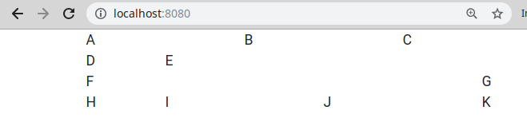

<text-box variant='learningObjectives' name='Oppimistavoitteet'>

- Tiedät mitä tyylitiedostot ovat ja tiedät mikä Twitter Bootstrap on.
- Osaat tuota Twitter Bootstrapin omaan sovellukseesi.
- Osaat määritellä Twitter Bootstrapia käyttäen sovellukseesi alueita ja ruudukkoja.
- Osaat tyylitellä sovelluksessasi olevia elementtejä (napit, taulukot, lomake-elementit) Twitter Bootstrapia käyttäen.

</text-box>


Olet ehkäpä huomannut, että web-sovelluksemme eivät ole kovin kaunista katsottavaa. Kurssilla pääpaino on palvelinpään toiminnallisuuden toteuttamisessa, joten sivujen tyylin määrittely on ollut käytännössä täysin paitsiossa. Korjataan tilannetta hieman.

Siinä missä HTML määrittelee sivun rakenteen ja sisällön, sivun asettelu ja tyyli määritellään Cascading Style Sheets (CSS)-tiedostoilla. Verkosta löytyy iso kasa CSS-oppaita -- esimerkiksi osoitteessa [https://www.w3schools.com/css/](https://www.w3schools.com/css/) oleva opas on hyvä lähtökohta tyylien määrittelyssä käytetyn CSS-kielen tarkasteluun.

Tällä kurssilla lähestymme tyylien määrittelyä hieman pragmaattisemmin ja jätämme CSS-kielen opiskelun käytännössä kokonaan väliin. Tutustumme sen sijaan lyhyesti suositun [Twitter Bootstrap](https://getbootstrap.com/) -kirjaston käyttöön.


## Twitter Bootstrapin käyttöönotto

Twitter Bootstrapin version 4.3.1 käyttöönotto tapahtuu määrittelemällä HTML-sivun `head`-elementin sisälle linkki Twitter Bootstrapin tyylitiedostoon.


```html
<link rel="stylesheet" href="https://stackpath.bootstrapcdn.com/bootstrap/4.3.1/css/bootstrap.min.css"/>
```

Bootstrapin tyylitiedoston lisäksi `head`-elementin sisälle lisätään pieni loitsu, jolla mahdollistetaan tyylien mukautuminen erilaisille päätelaitteille.

```html
<meta name="viewport" content="width=device-width, initial-scale=1, shrink-to-fit=no"/>
```

Olemme juuri oppineet käyttämään fragmentteja, joten Twitter Bootstrapin käyttöönotto fragmenttien kautta on luontevaa. Seuraava fragmentti sisältää kummatkin edellä olevat askeleet sekä parameterisoidun otsikon.

```html
<!DOCTYPE html>
<html xmlns="http://www.w3.org/1999/xhtml" xmlns:th="http://www.thymeleaf.org">
    <head th:fragment="head(title)" lang="en">
        <meta charset="UTF-8" />
        <title th:text="${title}">Otsikko</title>
        <meta name="viewport" content="width=device-width, initial-scale=1, shrink-to-fit=no"/>
        <link rel="stylesheet" href="https://stackpath.bootstrapcdn.com/bootstrap/4.3.1/css/bootstrap.min.css"/>
    </head>
    <body>
        <header th:fragment="header(text)">
            <h1 th:text="${text}">Otsikko</h1>
        </header>

        <footer th:fragment="links">
            <ul>
                <li><a th:href="@{/polku1}">Linkki 1</li>
                <li><a th:href="@{/polku2}">Linkki 2</li>
                <li><a th:href="@{/polku3}">Linkki 3</li>
                <li><a th:href="@{/polku4}">Linkki 4</li>
            </ul>
        </footer>

    </body>
</html>
```

<text-box variant='hint' name='Tyylitiedostojen hakeminen ja Content Delivery Network (CDN)'>

Twitter Bootstrapin käyttöönotossa lisäämme sivuillemme linkin tyylitiedostoon. Toisin kuin aiemmin linkkaamissamme sisällöissä kuten vaikkapa gif-tiedostojen käsittelyyn tarkoitetussa GifBin-tehtävässä, tiedosto ei sijaitsekaan samalla palvelimella sovelluksemme kanssa.

Kun `link`-elementille antaa `href`-attribuutiksi verkko-osoitteen, selain hakee verkko-osoitteen sivun latauksen yhteydessä. Tämän jälkeen verkko-osoitteessa ollut sisältö käsitellään, ja -- tyylitiedostojen tapauksessa -- sisältö tuodaan osaksi käyttäjälle näytettävää kokonaisuutta.

Edellä käytetyssä `bootstrap.min.css`-tiedoston sisältävässä osoitteessa näkyi termi `cdn`. Termi CDN (Content Delivery Network) viittaa sisällön jakamiseen tarkoitettuun palveluun. Sovelluksia toteutettaessa erityisesti selaimen käyttämiä resursseja kuten yleisiä tyylitiedostoja ja javascript-kirjastoja haetaan tällaisista CDN-palveluista -- etuna on muunmuassa se, että tällöin sovelluksen ei tarvitse sisältää näitä kaikkia.

Sovelluksen kehittäjä voi halutessaan toki tuoda kirjastoja myös omaan sovellukseensa. Eräs näppärä palvelu kirjastojen löytämiseen on [WebJars](https://www.webjars.org/)-palvelu, joka tarjoaa selaimen käyttämiä resursseja valmiiksi paketoituna.

</text-box>


## Tyylien tuominen sivuille ja asettelun alkeet

Bootstrap-tyylien, kuten muidenkin tyylien, käyttöönotto tapahtuu HTML-elementteihin lisättävän `class`-attribuutin arvojen avulla. Attribuutilla `class` määrätään elementin tyyliluokat, joita vastaavat tyylit löytyvät tyylitiedostoista.

Tärkein Bootstrapin tyyliluokka on `container`, jonka avulla määritellään asetteluun liittyviä alueita. Alue on keskitetty siten, että se sopii erilaisille näytöille. Tyylin voi asettaa mm. `main`, `div` ja `section` elementtien `class`-attribuutin arvoksi.

Seuraavissa esimerkeissä käytetään [JSFiddle](https://jsfiddle.net)-palvelua. Näet lähdekoodin välilehdellä `HTML` ja siihen liittyvän lopputuloksen välilehdellä `Result`. Sivuilla näkyy vain `body`-elementin sisältö, ja Bootstrap on ladattuna valmiiksi.

<iframe width="100%" height="220" src="https://jsfiddle.net/dywsev9a/embedded/html,result" allowfullscreen="allowfullscreen" frameborder="0"></iframe>

Tyylin `container` sisältävän elementin sisälle voi lisätä käytännössä minkä tahansa tyylistä sisältöä. Alueen määrittelyn lisäksi `container`-tyylin avulla voi määritellä sivulle ruudukon.

Ruudukon määrittelyssä pelaavat yhteen tyyliluokat `container` eli alue, `row` eli rivi ja `col` eli sarake. Tutustutaan ruudukon luomiseen seuraavaksi.

Kun sovellukseen luodaan ruudukko, tulee ensin luoda elementti, joka on tyylitelty `container`-tyyliluokalla. Tämän sisälle määritellään rivit -- kukin yksittäinen rivi määritellään `div`-elementillä, jonka tyyliluokkana on `row` eli rivi -- `<div class="row">`.

Rivin sisälle määritellään yksittäiset solut. Bootstrapissa kullakin rivillä on korkeintaan 12 solua. Yksittäisen solun määrittely tapahtuu tyyliluokalla `col-numero`, missä numeron kohdalle asetetaan leveys solujen lukumääränä. Esimerkiksi kaksi elementtiä, joissa kummassakin on tyyliluokkana `col-6`, vie koko rivin.

Alla olevaan esimerkkiin on määritelty rivi, joka sisältää kolme solua. Ensimmäinen solu vie puolet käytössä olevasta tilasta (`col-6`), ja seuraavat kaksi solua vie kumpikin puolet jäljelle jääneestä tilasta (`col-3`).


<iframe width="100%" height="350" src="https://jsfiddle.net/tzge0sh8/embedded/html,result" allowfullscreen="allowfullscreen" frameborder="0"></iframe>

Elementtejä, joihin on määritelty `container`-tyyliluokka, voi olla sovelluksessa useita. Alla olevassa esimerkissä on ensin otsikkoalue, jota seuraa erillinen kaksi riviä sisältävä alue.

<iframe width="100%" height="600" src="https://jsfiddle.net/boavr5qt/embedded/html,result" allowfullscreen="allowfullscreen" frameborder="0"></iframe>

Sovellukseen voi halutessaan tehdä myös omia tyylitiedostoja, jotka esimerkiksi tukevat Bootstrapin tyylejä. Omat tyylitiedostot asetetaan kansioon `src/main/resources/public/`, jonka sisällä oleviin tiedostoihin voi viitata suoraan ilman tarvetta kontrollerissa olevalle metodille. Esimerkiksi kansiossa `public` oleva tiedosto `style.css` voidaan ladata sivun käyttöön lisäämällä otsaketiedostoon seuraava rivi. Omat tyylit lisätään otsaketiedostoon Bootstrapin jälkeen.

```html
<link rel="stylesheet" th:href="@{/public/style.css}"/>
```

Edellisen esimerkin riveihin ja sarakkeisiin voi lisätä esimerkiksi täytettä "padding" tai vaikkapa oman taustavärin "background-color". Oma tyyliluokka määritellään luomalla `css`-tiedostoon alue, joka alkaa pisteellä ja tyyliluokan nimellä. Alue rajataan aaltosuluilla. Tyylit määritellään muodossa `tyylin-nimi: arvo` -- esimerkiksi `padding: 10px`. Lisää tyylejä löydät [w3schoolsin CSS-oppaasta](https://www.w3schools.com/css/).

```css
.cell {
    padding: 10px;
    background-color: #eee;
}
```

Kun tyylitiedosto on määritelty osaksi sivua ja selain lataa sen, tyylin saa käyttöön lisäämällä sen elementin tyyliluokaksi, esimerkiksi `<div class="cell">`. Tyyliluokkia voi määritellä elementtiin useita -- esim. `<div class="col-6 cell">`. Alla olevassa esimerkissä muutamaan soluun on määritelty edellä kuvattu tyyli.

<iframe width="100%" height="600" src="https://jsfiddle.net/Lzhnxm4t/embedded/html,css,result" allowfullscreen="allowfullscreen" frameborder="0"></iframe>


Yllä olevissa esimerkeissä solujen koko määriteltiin eksplisiittisesti. Solujen koon määrittelyn vastuun voi antaa myös Bootstrapille, jolloin Bootstrap pyrkii jakamaan alueen tasan elementtien kesken, riippuen elementtien sisällöstä. Tällöin tyyliluokkana käytetään pelkkää tyyliä `col`. Alla esimerkki.


<iframe width="100%" height="600" src="https://jsfiddle.net/9Lpqgcjo/embedded/html,result" allowfullscreen="allowfullscreen" frameborder="0"></iframe>


<programming-exercise name='Layout' tmcname='osa06-Osa06_03.Layout'>

Toteuta tehtäväpohjan `index.html`-tiedostoon Twitter Bootstrapin avulla seuraavanlainen neljä riviä sisältävä käyttöliittymän asettelu:

- Ensimmäisellä rivillä on kolme solua, joista kukin on yhtä leveä.
- Toisella rivillä on kaksi solua, joista ensimmäisen leveys on yksi kuudesosa rivin leveydestä, ja toisen leveys on viisi kuudesosaa rivin leveydestä.
- Kolmannella rivillä on kaksi solua, joista ensimmäisen leveys on viisi kuudesosaa rivin leveydestä ja toisen leveys on yksi kuudesosa rivin leveydestä.
- Neljännellä rivillä on neljä solua, joista ensimmäisen leveys on yksi kuudesosa rivin leveydestä, toisen ja kolmannen leveys on kaksi kuudesosaa rivin leveydestä, ja neljännen leveys on yksi kuudesosa rivin leveydestä.

Aseta solujen tekstiksi aakkoset merkistä A merkkiin K siten, että ensimmäisen rivin ensimmäisessä solussa on merkki A ja viimeisen rivin viimeisessä rivissä on merkki K.

Kun asettelu on valmis, se näyttää lopulta esimerkiksi seuraavalta (alla ruudun leveys on asetettu melko pieneksi).



Tehtävässä ei ole automaattisia testejä. Palauta tehtävä kun olet muokannut sitä tehtävänannon mukaisesti ja sovellus toimii halutulla tavalla.

</programming-exercise>


## Käyttöliittymäelementtien tyylittely

Bootstrap tarjoaa valmiit tyylit lähes kaikkiin käyttöliittymäelementteihin. Taulu `table` tyylitellään tyyliluokalla `table`, lomake-elementit (esim `input`) tyyliluokalla `form-control`, ja napit tyyliluokalla `btn` sekä siihen liittyvillä lisätyyleillä kuten ensisijaista nappia kuvaavalla tyylillä `btn-primary`.

Alla kuvattuna esimerkki näiden yhteiskäytöstä.

<iframe width="100%" height="400" src="https://jsfiddle.net/k867jsLw/embedded/html,result" allowfullscreen="allowfullscreen" frameborder="0"></iframe>

Yllä olevassa esimerkissä käyttöliittymäelementit ovat koko sivun levyisiä. Tämä johtuu siitä, ettei elementtejä ole määritelty näytettävän alueen kokoa rajaavan `container`-tyyliluokan sisältävän elementin sisälle. Seuraavassa esimerkissä käyttöliittymän elementit on määritelty "containeriin", jolloin Bootstrap ottaa vastuun elementtien leveyden määrittelystä.

<iframe width="100%" height="600" src="https://jsfiddle.net/qn7p6fat/embedded/html,result" allowfullscreen="allowfullscreen" frameborder="0"></iframe>


<programming-exercise name='Form' tmcname='osa06-Osa06_04.Form'>

Tehtäväpohjassa on valmiina sovellus, jossa pääset tarkastelemaan pienten tyylimuutosten vaikutusta siihen, miltä taulukko näyttää käyttäjälle.

Tutustu osoitteessa [https://www.w3schools.com/bootstrap4/bootstrap_forms.asp](https://www.w3schools.com/bootstrap4/bootstrap_forms.asp) olevaan Bootstrap-oppaaseen lomakkeiden käytöstä. Muokkaa sovelluksessa olevaa `form2.html`-tiedostoa siten, että se sisältää samanlaisen lomakkeen kuin `form1.html`-tiedosto, mutta lomakkeen tyylit on määritelty Bootstrapin avulla.

Tehtävässä ei ole automaattisia testejä. Palauta tehtävä kun olet saanut lomakkeen luotua ja tyyliteltyä Bootstrapin avulla.

</programming-exercise>


<quiz id="d5a37141-e86c-5ea1-9629-7f1aec43f72c"></quiz>
